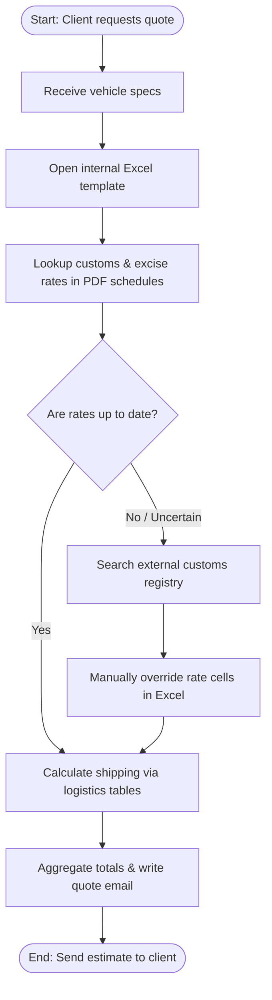
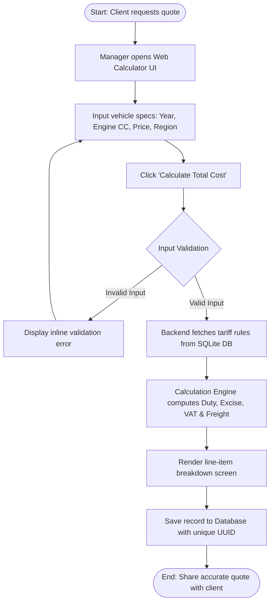

# Part 3: Process Modeling & Analysis (BPMN Workflow)

## 1. As-Is Process (Manual & Fragmented Workflow)

### Context & Bottlenecks
Prior to automation, import managers performed manual cost estimation across multiple spreadsheets, PDF custom rate schedules, and shipping carrier websites.

- **Cycle Time:** Up to several hours per vehicle calculation.
- **Key Bottlenecks:**
  - Manual search for engine displacement/age excise coefficients.
  - Risk of stale currency conversion rates.
  - Frequent Excel formula overrides causing pricing errors.

### As-Is Process Diagram



---

## 2. To-Be Process (Automated Web Calculator)

### Operational Improvements

With the **Vehicle Import Cost Calculator App**, manual lookup is eliminated. Rates, age brackets, and logistics parameters are queried directly from an updated SQLite relational database.

* **Cycle Time:** Less than 2 seconds.
* **Key Improvements:**
* Standardized parameter entry via validated web forms.
* Automatic tax and duty resolution via background calculation engine.
* Automated audit log generation and record saving.


### To-Be Process Diagram



---

## 3. As-Is vs To-Be Gap Analysis

| Process Dimension | As-Is State (Manual) | To-Be State (Automated) | Impact / Benefit |
| --- | --- | --- | --- |
| **Execution Time** | Several hours | Less than 2 seconds | 99% reduction in quote turnaround time |
| **Data Consistency** | Fragmented spreadsheets | Centralized SQLite database | Single source of truth for rates |
| **Error Rate** | High (Human error in formulas) | 0% (Rule-based engine) | Financial risk mitigation |
| **Auditability** | None | Automated timestamps & UUIDs | Full operational transparency |

```
